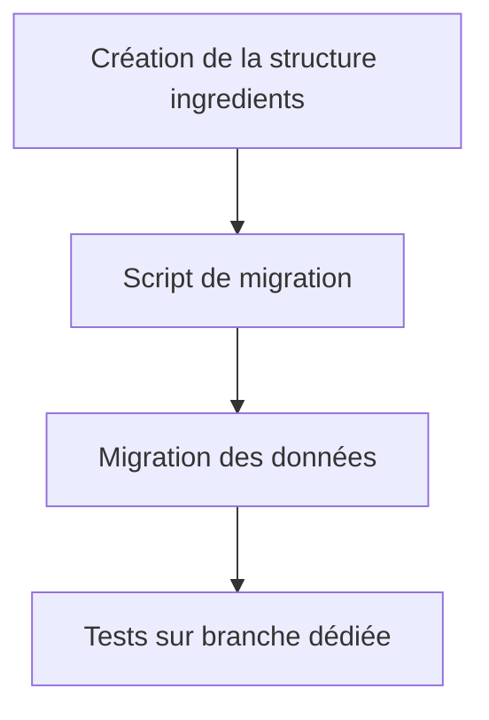

# PRD: Migration vers une collection unifiée d'ingrédients

## 1. Introduction
Ce document décrit la migration du système actuel d'ingrédients (stockés dans des fichiers de données) vers une collection Hugo unifiée (`content/ingredients`). Cette refonte permettra :
- Une gestion centralisée des ingrédients
- Une meilleure cohérence des données
- Des fonctionnalités étendues (liens entre recettes et ingrédients)

## 2. Objectifs
- **Centralisation** : Créer une source unique de vérité pour tous les ingrédients
- **Compatibilité CMS** : Adapter Decap CMS pour gérer la nouvelle structure
- **Maintenabilité** : Simplifier les mises à jour futures
- **Performance** : Maintenir des temps de build raisonnables (< 20% d'augmentation)

## 3. Périmètre
### Inclus
- Migration de 100% des recettes existantes
- Mise à jour des layouts Hugo concernés
- Configuration du CMS pour la nouvelle collection
- Script de migration automatisé
- Documentation technique

### Exclus
- Refonte de l'UI/UX des recettes
- Ajout de nouvelles fonctionnalités métier
- Modification des workflows existants

## 4. Plan de migration

### Phase 1 : Préparation


### Phase 2 : Exécution
1. Créer la collection `content/ingredients`
2. Générer les fichiers d'ingrédients
3. Transformer les recettes existantes
4. Mettre à jour les layouts Hugo
5. Adapter la configuration Decap CMS

### Phase 3 : Validation
- Tests sur 10 recettes représentatives
- Vérification des performances (build Hugo)
- Revue cross-team (dev + content)

## 5. Spécifications techniques

### 5.1 Structure des données
**Ancien format (recette) :**
```yaml
ingredients:
  legumes:
    - title: Carotte
      quantite: 2
      unit: kg
```

**Nouveau format :**
```yaml
ingredients:
  - ingredient: carotte  # Slug de l'ingrédient
    quantite: 2
    unit: kg
```

**Fichier d'ingrédient (`content/ingredients/legumes/carotte.md`) :**
```yaml
---
title: Carotte
type: legumes
alergenes: []
pFrais: true
---
```

### 5.2 Script de migration
**Caractéristiques :**
- Langage : Python 3.10+
- Entrée : Dossier `content/recettes`
- Sortie : Fichiers migrés + rapports
- Fonctionnalités :
  - Détection automatique des ingrédients uniques
  - Génération des fichiers d'ingrédients
  - Transformation des recettes
  - Rapport d'erreurs

**Pseudocode :**
```python
for recipe in content/recettes/**/*.md:
    for ingredient_group in recipe.ingredients:
        for ingredient in ingredient_group:
            slug = slugify(ingredient.title)
            create_ingredient_file_if_missing(slug, ingredient)
            new_ingredients.append({
                "ingredient": slug,
                "quantite": ingredient.quantite,
                "unit": ingredient.unit
            })
    recipe.ingredients = new_ingredients
    save(recipe)
```

### 5.3 Modifications des layouts
**Fichiers impactés :**
1. `layouts/_default/recettes.html`
2. `layouts/evenements/single.json.json`
3. `layouts/evenements/single.html`
4. `layouts/evenements/single.ingredients.html`
5. `layouts/evenements/single.poster.html`

**Modifications clés :**
```go-html-template
<!-- Ancien -->
{{ range $type, $items := .Params.ingredients }}

<!-- Nouveau -->
{{ $grouped := .Params.ingredients | groupBy "type" }}
{{ range $type, $items := $grouped }}
```

### 5.4 Configuration CMS
**Nouvelle structure Decap :**
```yaml
- name: ingredients
  label: Ingrédients
  folder: content/ingredients
  fields:
    - { label: Nom, name: title, widget: string }
    - { label: Type, name: type, widget: select, options: [légumes, fruits, ...] }

- name: recettes
  fields:
    - label: Ingrédients
      name: ingredients
      widget: list
      fields:
        - { label: Ingrédient, name: ingredient, widget: relation, collection: ingredients }
        - { label: Quantité, name: quantite, widget: number }
        - { label: Unité, name: unit, widget: string }
