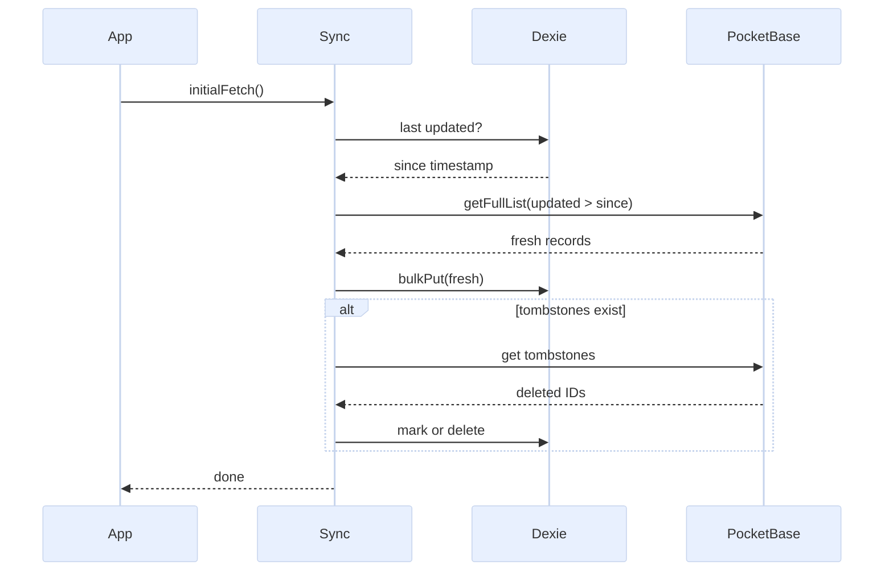
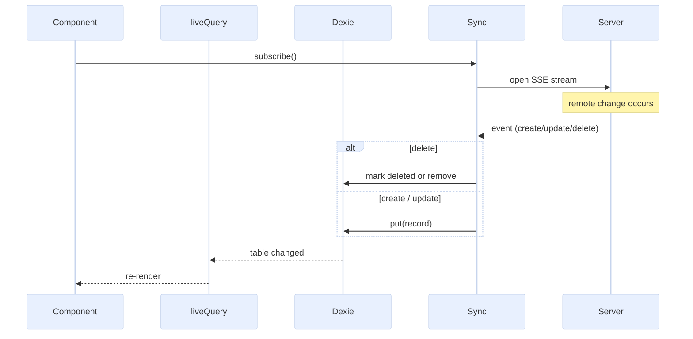
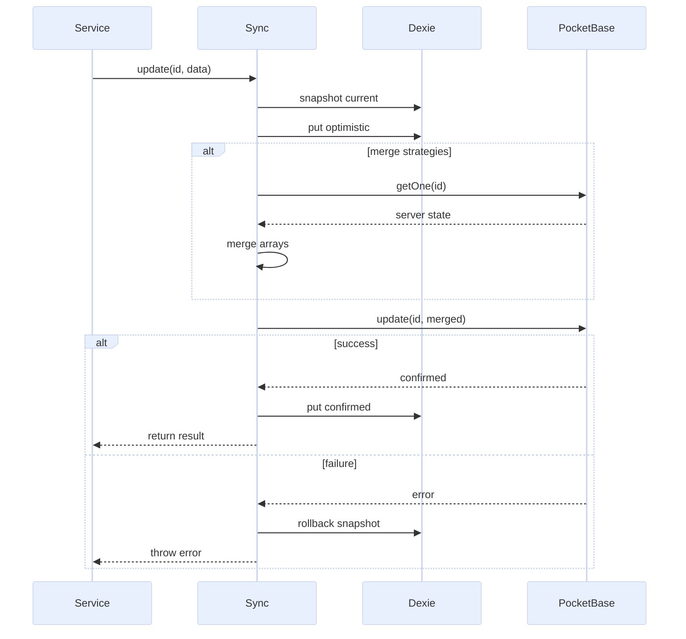
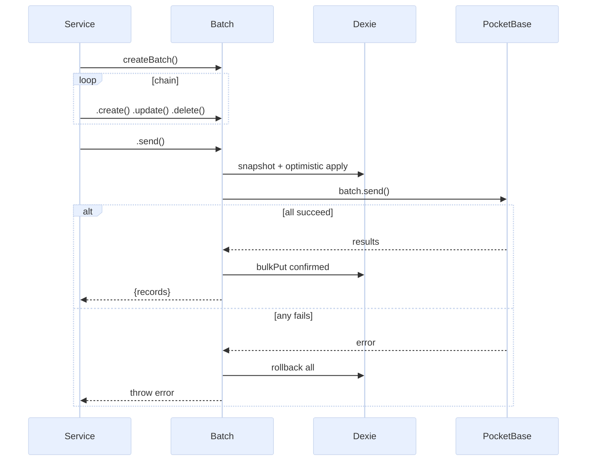
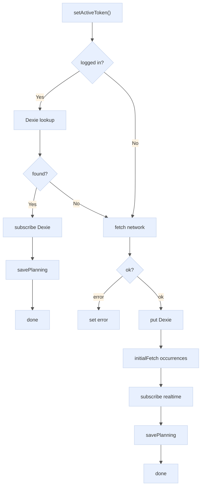
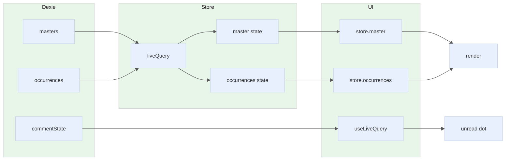

# pb-sync

Offline-first synchronization layer bridging **PocketBase** (remote) and **Dexie / IndexedDB** (local).

## Architecture

```
┌─────────────┐     createSyncCollection()     ┌──────────┐
│ PocketBase  │ ◄────── CRUD / Batch ─────────► │  Dexie   │
│  (remote)   │ ◄────── realtime events ─────── │ (local)  │
└─────────────┘                                 └────┬─────┘
                                                     │
                                               useLiveQuery()
                                               liveQuery()
                                                     │
                                               ┌──────▼──────┐
                                               │  Svelte 5   │
                                               │ components  │
                                               └─────────────┘
```

---

## Flow Diagrams

### 1. Initial Fetch — Delta Sync

`initialFetch()` retrieves only records changed since the last known `updated` timestamp.



### 2. Realtime Subscription — Server → UI

PocketBase pushes events via SSE. pb-sync mirrors them to Dexie, triggering reactive UI updates.



### 3. CRUD Write — Optimistic Update with Rollback

Writes are optimistic: Dexie updates immediately, then PocketBase. On failure, Dexie rolls back.



### 4. Batch Operations — Atomic Multi-Record

`createBatch()` chains operations into a single PocketBase batch request with full rollback.



### 5. Guest vs Auth Activation Flow

Two different paths depending on whether the user is authenticated.



### 6. Component Read — Dexie → Reactive UI

Components read from Dexie via `liveQuery` or `useLiveQuery`, never directly from PocketBase.



---

## Modules

| File                       | Purpose                                                     |
| -------------------------- | ----------------------------------------------------------- |
| `collection.ts`            | `createSyncCollection()` — main bridge API                  |
| `types.ts`                 | Shared TypeScript types                                     |
| `db.ts`                    | Dexie database schema (`appDB`)                             |
| `batch.ts`                 | Standalone `executeBatch()` for multi-collection operations |
| `use-live-query.svelte.ts` | Svelte 5 reactive wrapper around Dexie `liveQuery`          |

---

## API Reference

### `createSyncCollection<T>(pb, table, collectionName, options?)`

Creates a sync collection that binds a PocketBase collection to a Dexie table with realtime subscriptions and conflict-resolution strategies.

**Parameters:**

| Param            | Type                       | Description                        |
| ---------------- | -------------------------- | ---------------------------------- |
| `pb`             | `PocketBase`               | PocketBase client instance         |
| `table`          | `Dexie.Table<T>`           | Dexie table to sync with           |
| `collectionName` | `string`                   | PocketBase collection name         |
| `options`        | `SyncCollectionOptions<T>` | Optional configuration (see below) |

**Options:**

```ts
interface SyncCollectionOptions<T> {
	mergeStrategies?: {
		// Per-field merge function: (localValue, remoteValue) => mergedValue
		[K in keyof T]?: (local: T[K], remote: T[K]) => T[K];
	};
	softDelete?: boolean; // default: true — mark deleted instead of removing
	tombstoneCollection?: string; // PocketBase collection tracking server-side deletions
	localTrash?: boolean; // keep soft-deleted records locally with {deleted: true}
}
```

**Returns** an object with the following methods:

#### Lifecycle

| Method           | Signature                                                  | Description                                                                                                                                      |
| ---------------- | ---------------------------------------------------------- | ------------------------------------------------------------------------------------------------------------------------------------------------ |
| `initialFetch`   | `(params?: PbQueryOptions) => Promise<void>`               | Incremental sync: fetches records updated since last local `updated` timestamp. Also reconciles server-side deletions via `tombstoneCollection`. |
| `subscribe`      | `(params?: PbSubscribeOptions) => SubscriptionRef`         | Opens a PocketBase realtime subscription. Events are applied to Dexie. Returns a `SubscriptionRef` for later unsubscription.                     |
| `unsubscribe`    | `(subRefOrId: SubscriptionRef \| string) => Promise<void>` | Closes a specific realtime subscription.                                                                                                         |
| `unsubscribeAll` | `() => Promise<void>`                                      | Closes all active realtime subscriptions for this collection.                                                                                    |

#### CRUD

| Method   | Signature                                                                | Description                                                                                                          |
| -------- | ------------------------------------------------------------------------ | -------------------------------------------------------------------------------------------------------------------- |
| `create` | `(data: Omit<T, 'id' \| 'updated' \| 'created'>, params?) => Promise<T>` | Creates a record on PocketBase, then mirrors to Dexie.                                                               |
| `update` | `(id: string, data: Partial<T>, params?) => Promise<T>`                  | Optimistic write to Dexie, then PocketBase. On failure, rolls back Dexie. Applies merge strategies for array fields. |
| `remove` | `(id: string, params?) => Promise<void>`                                 | Soft-delete or hard-delete (based on `softDelete` option). Rolls back on failure.                                    |

#### Read (direct PocketBase)

| Method | Signature                                               | Description                                     |
| ------ | ------------------------------------------------------- | ----------------------------------------------- |
| `list` | `(params?: PbListOptions) => Promise<PaginatedList<T>>` | Paginated query directly to PocketBase.         |
| `view` | `(id: string, params?) => Promise<T>`                   | Fetch a single record directly from PocketBase. |

#### Batch

| Method        | Signature                                 | Description                         |
| ------------- | ----------------------------------------- | ----------------------------------- |
| `createBatch` | `(params?) => CollectionBatch`            | Returns a chainable batch builder.  |
| `bulkCreate`  | `(items[], params?) => Promise<T[]>`      | Shorthand: create multiple records. |
| `bulkUpdate`  | `({id, data}[], params?) => Promise<T[]>` | Shorthand: update multiple records. |
| `bulkUpsert`  | `(items[], params?) => Promise<T[]>`      | Shorthand: upsert multiple records. |
| `bulkDelete`  | `(ids[], params?) => Promise<void>`       | Shorthand: delete multiple records. |

#### Utility

| Method           | Signature        | Description                                            |
| ---------------- | ---------------- | ------------------------------------------------------ |
| `getTable`       | `() => Table<T>` | Returns the underlying Dexie table for direct queries. |
| `collectionName` | getter           | Returns the PocketBase collection name.                |

---

### `mergeByKey<T>(key: string)`

Factory that creates a merge strategy for array fields. Merges local and remote arrays by a unique key, preferring local values on conflict.

```ts
// Example: merge participants by 'id'
mergeStrategies: {
	participants: mergeByKey<Participant>('id');
}
```

---

### `useLiveQuery<T>(querier, deps?)`

Svelte 5 reactive wrapper. Must be called from a component `<script>` block (requires `$effect` context).

```ts
const query = useLiveQuery(
	() => db.masters.get(masterId),
	() => [masterId] // optional reactive deps
);

// query.current  — latest value
// query.isLoading — boolean
// query.error    — any
```

---

### Query Options

All operations accept optional `PbQueryOptions`:

```ts
interface PbQueryOptions {
	filter?: string | [template: string, vars: Record<string, unknown>];
	expand?: string; // e.g. 'master,owner'
	fields?: string; // e.g. 'id,title,updated'
	query?: Record<string, string>; // raw query params, e.g. { _token: '...' }
}

interface PbSubscribeOptions extends PbQueryOptions {
	record?: string; // specific record ID, or omit for '*'
}

interface PbListOptions extends PbQueryOptions {
	sort?: string;
	page?: number;
	perPage?: number;
}
```

---

### `executeBatch(pb, operations)`

Standalone batch executor for operations spanning **multiple collections**. Takes snapshots before applying, rolls back on failure.

```ts
await executeBatch(pb, [
  { type: 'create', table: db.masters, collection: 'planning_masters', data: {...} },
  { type: 'update', table: db.occurrences, collection: 'planning_occurrences', id: '...', data: {...} },
]);
```

---

## Usage in the Project

### 1. Store Setup (`planningStore.svelte.ts`)

Two sync collections are created with merge strategies for concurrent array field resolution:

```ts
export const mastersCollection = createSyncCollection<PlanningMaster>(
	pb,
	db.masters,
	'planning_masters',
	{ mergeStrategies: { participants: mergeByKey('id'), tasks: mergeByKey('id') } }
);

export const occurrencesCollection = createSyncCollection<PlanningOccurrence>(
	pb,
	db.occurrences,
	'planning_occurrences',
	{
		mergeStrategies: {
			responses: mergeByKey('participantId'),
			comments: mergeByKey('id'),
			tasks: mergeByKey('id')
		}
	}
);
```

### 2. Guest Flow — Full Sync (`#setActiveGuest`)

```ts
// 1. Initial fetch (incremental delta)
await occurrencesCollection.initialFetch({
	filter: ['master = {:masterId}', { masterId: master.id }],
	query: { _token: token }
});

// 2. Subscribe to realtime updates
mastersCollection.subscribe({ record: master.id, query: { _token: token } });
occurrencesCollection.subscribe({
	filter: ['master = {:masterId}', { masterId: master.id }],
	query: { _token: token }
});
```

### 3. Auth Flow — Dexie-Only (`#setActiveAuth`)

Authenticated users skip network fetch — data is already synced by the layout. They subscribe directly to Dexie `liveQuery`:

```ts
this.#masterSub = liveQuery(() => db.masters.get(masterId)).subscribe({
	next: (val) => {
		this.#master = val ?? null;
	}
});
```

### 4. CRUD via Service Layer (`planningActions.ts`)

Components never call PocketBase directly. All mutations go through the service layer:

```ts
// Create
const master = await mastersCollection.create({ title, ... });

// Create with batch
const batch = occurrencesCollection.createBatch();
for (const date of dates) batch.create({ master: master.id, date, ... });
await batch.send();

// Update (with merge strategy for array fields)
await mastersCollection.update(masterId, { participants: [...] }, { query: { _token } });

// Delete (soft-delete by default)
await mastersCollection.remove(masterId, { query: { _token } });
```

### 5. Component Reactive Reads (`OccurrenceView.svelte`)

Components use `useLiveQuery` for local Dexie tables that aren't covered by the store:

```ts
const commentStateQuery = useLiveQuery(
	() => db.commentState.get(occurrence.id),
	() => [occurrence.id]
);
```

### 6. Cleanup

On planning deactivation, all realtime subscriptions are torn down:

```ts
mastersCollection.unsubscribeAll();
occurrencesCollection.unsubscribeAll();
```

---

## Database Schema (`db.ts`)

```ts
// Dexie tables (appDB)
masters: 'id, updated, participantToken, adminToken, deleted';
occurrences: 'id, updated, master, date, deleted';
deletions: 'id, collection, deletedAt, recordId';
localMeta: 'masterId';
commentState: 'occurrenceId, masterId, isUserInConversation, lastReadAt';
```

A `dbcore` middleware strips Svelte 5 `$state` Proxy objects before Dexie writes (IndexedDB `structuredClone` cannot handle Proxies).

---

## Error Handling

- **CRUD rollback**: `update()` and `remove()` snapshot the local record before sending to PocketBase. On failure, the snapshot is restored.
- **Batch rollback**: `createBatch().send()` snapshots all affected records. On failure, the transaction is rolled back to the pre-batch state.
- **Subscription failures**: Non-blocking — logged as warnings, do not prevent planning activation.
